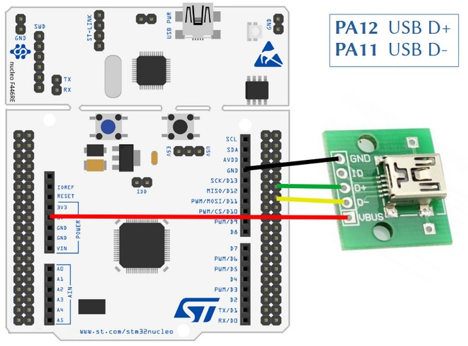

# USB MSD demo
## project name: mbed6_usbMSD
Tested by: **Keil Studio** 1.50 and **Mbed-OS** 6.16.0

This program implements a simple USB SD card reader.
The [USBMSD class](https://os.mbed.com/docs/mbed-os/v6.15/apis/usbmsd.html) implements the USB mass storage device, 
for its instantiation a block data transfer device (here the SD card) must be provided.
We use the [SDBlockDevice class](https://os.mbed.com/docs/mbed-os/v6.15/apis/sdblockdevice.html) to manage the SD card

### Reference:
[USBMSD SDBlockDevice example](https://os.mbed.com/docs/mbed-os/v6.15/apis/usbmsd.html) (an example from Mbed-OS User Guide)

## Hardware requirements
* NUCLEO-F446RE development board
* SD card breakout (we used an 1.8" TFT board wich has an SD card socket on the back side)
* USB connector breakout for the STM32F446RE USBFS channel
* USB connection to a PC through the built-in ST-Link v2-1

## Wiring instructions for the NUCLEO-F446RE board

We selected the SPI3 channel for driving the SD card. 

| SD card | color | signal |pin   |
|:-------:|:----: |:-----:|:-------:|
|  DO    | blue   | MISO  | PC11    |
|  SCLK  | yellow | SCLK  | PC10    |
|  DI    | green  | MOSI  | PC12    |
|  CS    | brown  | CS    | PD2     |
|  VCC   | red    | VCC   | 5V/3.3V |
|  GND   | black  | GND   | GND     |


There is no USB connector for the USBFS channel of the target CPU therefore we have to prepare connection
by using an USB cable and an USB socket breakout card.

| USB breakout  | NUCLEO-F446RE pin   |
|:-------:|:-----: |
|  GND    |GND     | 
|  ID     | --     | 
|  D+     | PA_12  |
|  D-     | PA_11  | 
|  VBUS   | 5V     | 




The complete arrangement is shown in the picture below.


## Software requirements
* Start with an empty mbed 6 project
* Edit the main.cpp source file
* Configure the project by adding an **mbed_app.json** file in which
    * We have to add the **SD** component and the **STORAGE** features_add
    * We have to override the default SPI pin connections according to the selected **SPI3** channel
    * We have to configure the **usb_speed** parameter
    * We have to add **USBDEVICE** to the device list of the target

Finally the **mbed_app.json** sholuld look like this: 

```
{
    "config": {
        "usb_speed": {
            "help": "USE_USB_OTG_FS or USE_USB_OTG_HS or USE_USB_HS_IN_FS",
            "value": "USE_USB_OTG_FS"
        }
    },    
    "target_overrides": {
        "*": {       
            "target.features_add": ["STORAGE"],
            "target.components_add": ["SD"],            
            "sd.SPI_MOSI" : "PC_12",
            "sd.SPI_MISO" : "PC_11",
            "sd.SPI_CLK"  : "PC_10",
            "sd.SPI_CS"   : "PD_2",
            "target.device_has_add": ["USBDEVICE"]     
        }
    }
}
```
## mbed6_usbMSD results
After connecting, it may be necessary to format the SD card first, 
then we can write/read its file system as usual with pen drives


